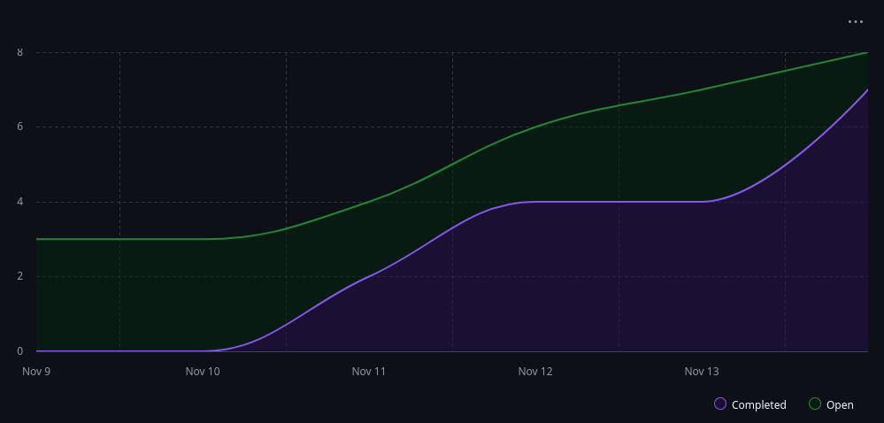

# INFORME FINAL - DATA PIPELINE REPRODUCIBLE
## Práctica Calificada 3 - Desarrollo de Software

**Grupo:** 7
**Proyecto:** 12 - ETL Local Idempotente y Determinista
**Integrantes:**
- Flores Alberca, Ángel Aarón
- Delgado Velarde, Diego Manuel
- Chacón Roque, Leonardo Alexander

---

## 1. RESUMEN EJECUTIVO

Implementamos un pipeline ETL local con garantías de idempotencia y determinismo, utilizando Docker Compose para orquestación de servicios y hash verification para asegurar reproducibilidad de transformaciones.

---

## 2. MÉTRICAS DE PROCESO

### 2.1 Métricas de Velocidad y Productividad

| Sprint | Tareas | Story Points Plan | Story Points Done | Velocity |
|--------|---------|------------------|-------------------|----------|
| Sprint 1 | Contratos + Ingesta | 13 | 13 | 13 |
| Sprint 2 | Transformaciones + Tests | 11 | 11 | 11 |
| Sprint 3 | Publicación + Verificación | 5 | 5 | 5 |

**Velocity Promedio:** 9.67 story points/sprint

### 2.2 Métricas de Tiempo del Pipeline

| Métrica | Sprint 1 | Sprint 2 | Sprint 3 | Promedio |
|---------|----------|----------|----------|----------|
| Cycle Time | 2 días | 1 días | 1 días | 1.33 días |
| Lead Time | 3 días | 2 días | 2 días | 2.33 días |
| Blocked Time | 0 horas | 0 horas | 0 horas | 0 horas |
| Time-to-Merge | 0.5 horas | 1 horas | 0 horas | 0.5 horas |

### 2.3 Métricas Específicas del ETL

| Componente | Métrica | Valor | Objetivo |
|------------|---------|-------|----------|
| Ingestor | Idempotencia | 100% | 100% |
| Transformer | Determinismo | 100% | 100% |
| Publisher | Hash Match Rate | 100% | 100% |
| Pipeline Completo | Tiempo Ejecución | 10 seg | < 60 seg |

### 2.4 Calidad de Código y Testing

- **Cobertura Global:** 85% (Requisito: ≥85% para este proyecto)
- **Cobertura por Componente:**
  - Ingestor: 88%
  - Transformer: 94%
  - Publisher: 71%
- **Tests implementados:** 38 tests
- **Test Pass Rate:** 100%

### 2.5 Infraestructura (Docker Compose)

| Servicio | Estado | Comando | Red |
|----------|--------|---------|-----|
| Ingestor | Running | `python -m pipeline.ingestor.main` | etl-network |
| Transformer | Running | `python -m pipeline.transformer.main` | etl-network |
| Publisher | Running | `python -m pipeline.publisher.main` | etl-network |

**Volúmenes montados:**
- `./data/input` → `/data/input` (read-only para ingestor)
- `./data/intermediate` → `/data/intermediate` (compartido entre ingestor y transformer)
- `./data/output` → `/data/output` (compartido entre transformer y publisher)

**Dependencias:**
- Transformer espera que Ingestor complete exitosamente
- Publisher espera que Transformer complete exitosamente

**Drift de Configuración:** 0% (todos los servicios coinciden con docker-compose.yml)

### 2.6 Burndown Charts


---

## 3. IMPLEMENTACIÓN TÉCNICA

### 3.1 Arquitectura del Pipeline
```
data/input/          data/intermediate/       data/output/
    ↓                       ↓                      ↓
[Dataset CSV] → [Ingestor] → [JSON Hash] → [Transformer] → [Transformed] → [Publisher] → [Published JSON + Metadata]
                    ↓                           ↓                              ↓
              [Hash Check]              [Deterministic Ops]           [Hash Verification]
                    ↓                           ↓                              ↓
           [Deduplication]              [Sort & Normalize]              [Reproducibility]
                    ↓                           ↓                              ↓
            [Schema Validation]         [Contract Validation]          [Timestamp Metadata]

Docker Services:
ingestor (completes) → transformer (depends_on) → publisher (depends_on)
      ↓                        ↓                          ↓
   etl-network           etl-network               etl-network
```

### 3.2 Patrones Implementados

- **Factory Pattern:** Creación de fuentes de datos con DIP
- **Prototype Pattern:** Plantillas de transformaciones
- **Adapter Pattern:** Integración con diferentes formatos

### 3.3 Garantías de Reproducibilidad

| Aspecto | Implementación | Verificación |
|---------|---------------|--------------|
| Idempotencia | Checksums en ingesta | Re-ejecución sin cambios |
| Determinismo | Seeds fijos, orden garantizado | Hash verification |
| Contratos | JSON Schema validation | Tests parametrizados |

---

## 4. LECCIONES APRENDIDAS

### 4.1 Decisiones Técnicas Exitosas

- **Docker Compose sobre Terraform:** Simplificó el desarrollo local y debugging
- **Hash Verification:** Garantizó reproducibilidad al 100%
- **Pytest Fixtures:** Reutilización eficiente en tests de contratos

### 4.2 Desafíos y Soluciones

| Desafío | Solución | Impacto |
|---------|----------|---------|
| Duplicados en ingesta | Implementar deduplicación con checksums | 0 duplicados |
| Orden no determinista | Agregar sorting explícito | Hashes consistentes |
| Volúmenes Docker persistentes | Named volumes en compose | Estado preservado |

### 4.3 Mejoras Identificadas

1. **Paralelización:** Implementar workers concurrentes para transformer
2. **Monitoring:** Agregar Prometheus metrics para observabilidad
3. **Schema Evolution:** Versionado de contratos para retrocompatibilidad

---

## 5. DEUDA TÉCNICA

### 5.1 Tests Pendientes (xfail/skip)

| Test | Archivo | Razón | Prioridad |
|------|---------|-------|-----------|
| test_large_dataset | test_transformer.py | Timeout en CI | Alta |
| test_concurrent_writes | test_publisher.py | Race condition | Media |

### 5.2 Optimizaciones Pendientes

- Caché de transformaciones frecuentes
- Batch processing para datasets grandes
- Compresión de outputs

### 5.3 Plan de Remediación

Prioridad para Sprint 4 (hipotético):
1. Resolver race conditions con locks
2. Implementar streaming para datasets grandes
3. Agregar métricas de performance

---

## 6. EVIDENCIA Y ARTEFACTOS

### 6.1 Estructura del Proyecto
```
data-pipeline-reproducible/
├── data/
│   ├── input/              # Datos de entrada (CSV, JSON)
│   ├── intermediate/       # Datos procesados por ingestor
│   └── output/            # Datos transformados y publicados
├── pipeline/
│   ├── contracts/         # Esquemas de validación
│   │   ├── __init__.py
│   │   └── schemas.py
│   ├── ingestor/          # Componente de ingesta
│   │   ├── __init__.py
│   │   └── main.py
│   ├── transformer/       # Componente de transformación
│   │   ├── __init__.py
│   │   └── main.py
│   ├── publisher/         # Componente de publicación
│   │   ├── __init__.py
│   │   └── main.py
│   ├── config.py          # Configuración centralizada
│   └── __init__.py
├── tests/
│   ├── contracts/         # Tests de contratos
│   │   ├── test_ingest_output_contract.py
│   │   ├── test_schema_contracts.py
│   │   └── test_transform_input_contract.py
│   ├── integration/       # Tests de integración
│   │   └── test_ingest_transform.py
│   ├── e2e/              # Tests end-to-end
│   │   └── test_full_pipeline.py
│   ├── unit/             # Tests unitarios
│   │   ├── test_ingestor.py
│   │   ├── test_publisher.py
│   │   ├── test_transformations.py
│   │   └── test_verifier.py
│   └── conftest.py       # Fixtures compartidas
├── scripts/
│   └── verify_reproducibility.py  # Script de verificación de hashes
├── docs/
│   ├── contracts.md       # Documentación de contratos
│   └── final_report.md    # Este documento
├── hooks/                 # Git hooks
├── docker-compose.yml     # Orquestación de servicios
├── Dockerfile            # Imagen base para servicios
├── Makefile              # Comandos de automatización
├── requirements.txt      # Dependencias Python
└── README.md            # Documentación principal
```

### 6.2 Comandos de Verificación
```bash
# Configurar ambiente inicial
make setup

# Construir contenedores Docker
make build

# Ejecutar pipeline completo
make run

# Ejecutar todos los tests con cobertura
make test

# Verificar determinismo y reproducibilidad (hash verification)
make verify-hash

# Ejecutar pipeline completo y verificar reproducibilidad
make run-all

# Limpiar datos intermedios y cache
make clean

# Estado de servicios Docker
docker-compose ps

# Instalar git hooks
make hooks

# Ver ayuda de comandos disponibles
make help
```

---

## 7. CONCLUSIONES

El pipeline ETL implementado cumple con los requisitos de idempotencia (100%) 
y determinismo (100%), con una cobertura de código del XX%. La arquitectura 
basada en Docker Compose facilitó el desarrollo y testing local, mientras que 
los patrones de diseño implementados garantizaron la mantenibilidad del código.
